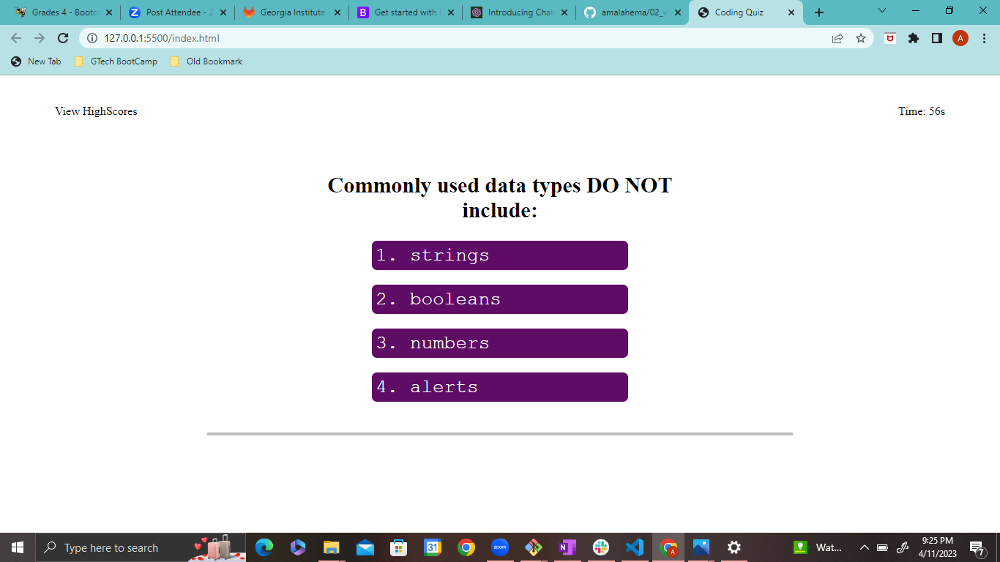

# Web APIs: Code Quiz
## Table of Contents
- Overview
    - The Challenge
    - Screenshot
    - Links
- My Approach
    - Code construction
    - Learnings
- Author

## Overview

### The Challenge

GIVEN I am taking a code quiz
WHEN I click the start button
THEN a timer starts and I am presented with a question
WHEN I answer a question
THEN I am presented with another question
WHEN I answer a question incorrectly
THEN time is subtracted from the clock
WHEN all questions are answered or the timer reaches 0
THEN the game is over
WHEN the game is over
THEN I can save my initials and my score

### Screenshot

### Links

- GitHub URL - 

## My Approach

### Code construction

- Java Script - DOM
- HTML & CSS

### Learnings

   - Design a quiz and set the timer and check the score
   - Call the specific fuction when the event is performed 
   - How to store the data in the local storage
   - How to use json
   - How to retrive the data from the local storage
   - How to clear the each content and push the next one 
   - How to manipulate dom using set attribue and classlist 

   # Author

   - Amala Hema , https://github.com/amalahema
